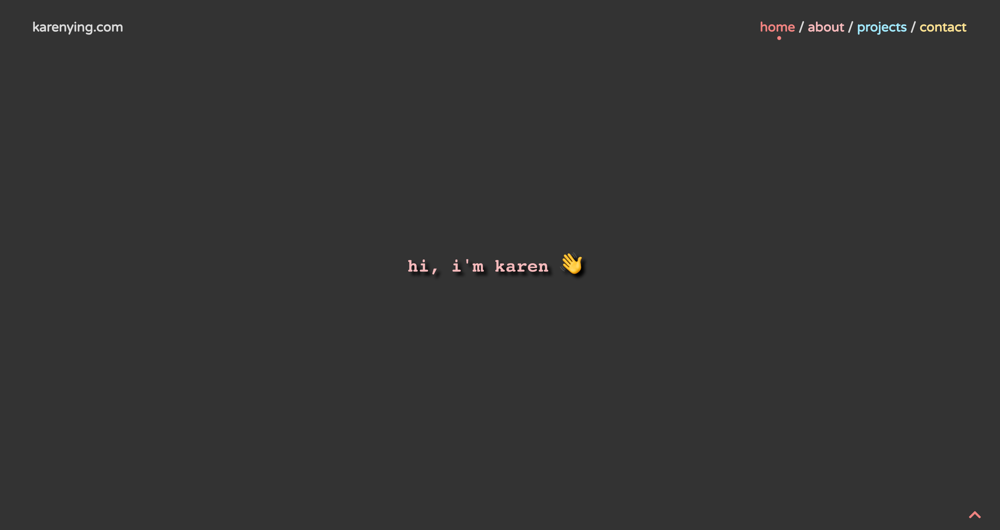

# [karenying.com](https://karenying.com)

Personal/portfolio site of Karen Ying.

This site was bootstrapped with [Create React App](https://github.com/facebook/create-react-app). It heavily depends on [Material UI](https://material-ui.com/) for styling and responsiveness. 

It is statically hosted on [Netlify](http://netlify.com/). Read about enabling redirects on Netlify to fix client-side routing for SPAs [here](https://medium.com/javascript-in-plain-english/404-react-page-not-found-355b9352041e?source=friends_link&sk=df8e7824a1c93cd1604afc464282f78c).

A tutorial for the [carousel](https://karenying.com/projects) can be found [here](https://levelup.gitconnected.com/adding-transitions-to-a-react-carousel-with-material-ui-b95825653c1b?source=friends_link&sk=4e012ba17cb0e2297c526ce142c6e7fc).

## Installation

1. Clone this repo
2. `npm install`
3. `npm start`
